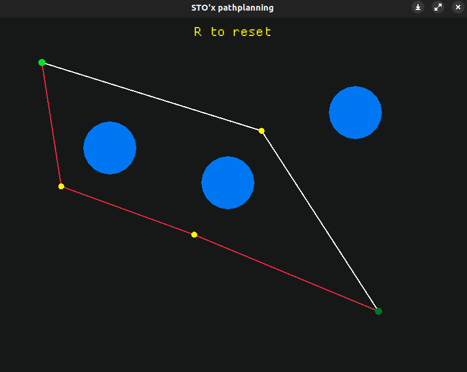

# PathDrawer

Visualization and implementation of STOx's path planning.

<p align="center">
  
</p>

## Instructions

- Left mouse button to set the start and goal points;
- Right mouse button to set enemies/obstacles (max 3);
- Press `R` to reset the field at any time.

## How to run the program

```bash
git clone git@github.com:ringass/path-drawer.git
cd path-drawer
cargo run
```